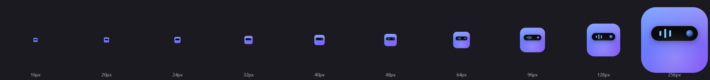
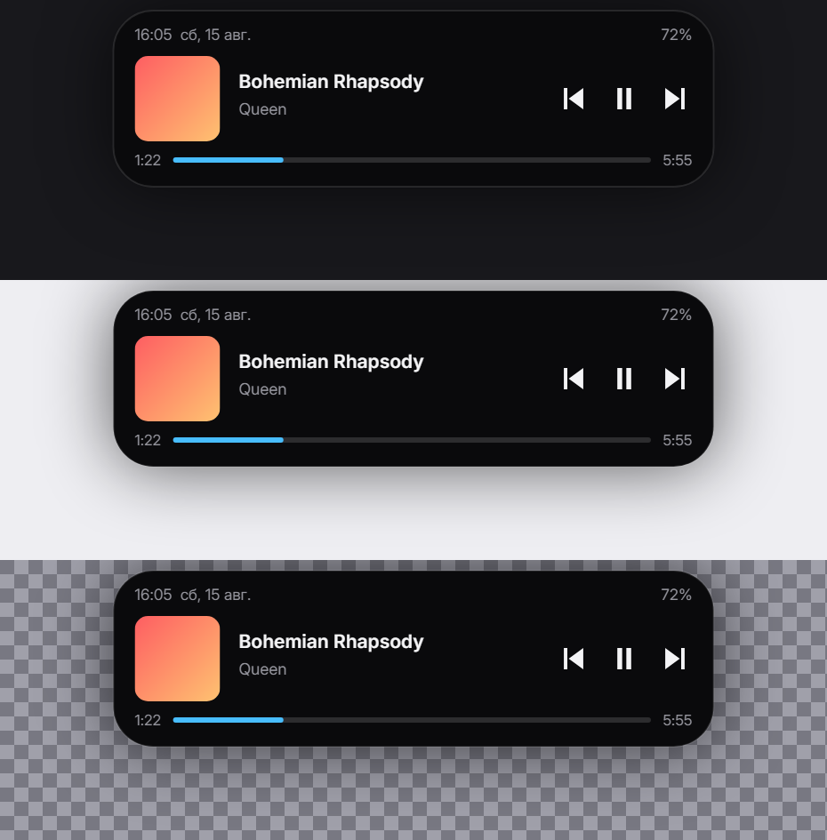
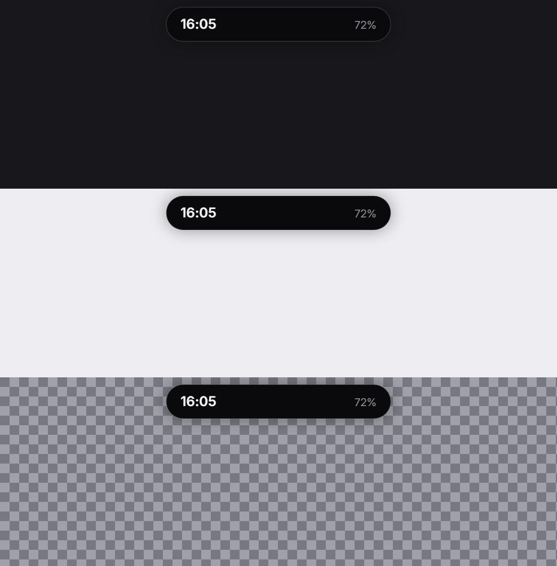
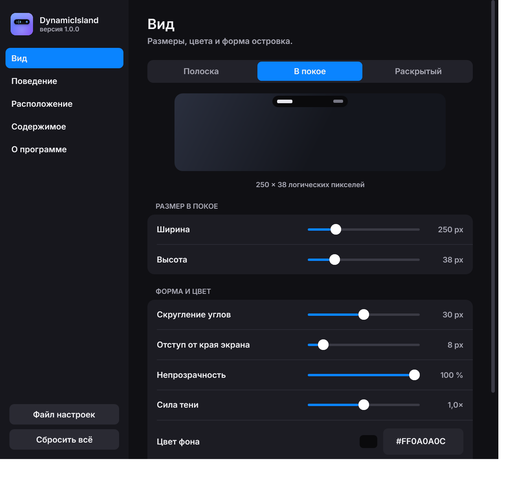
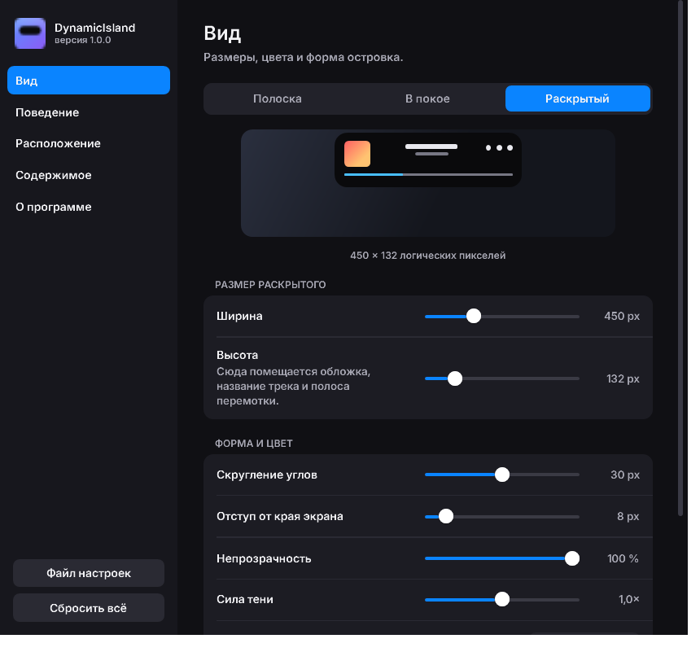

<div align="center">



# DynamicIsland

**Динамический островок для Windows.** Часы, заряд и плеер в вырезе у верхней кромки экрана —
на Direct3D 12, с нулевым расходом процессора в покое.

[](#установка)
[](#сборка-из-исходников)
[](LICENSE)
[](https://github.com/FSDITM/DynamicIsland/releases/latest)



</div>

---

## Что это

Островок живёт у верхней кромки экрана. В покое показывает время и заряд,
при наведении раскрывается в плеер с обложкой, названием трека и перемоткой.
Когда мешает — сворачивается в тонкую полоску или исчезает совсем.

<div align="center">

</div>

## Возможности

**Плеер.** Обложка, название, исполнитель, пауза, переключение треков и полоса
перемотки — через штатный Windows-API `GlobalSystemMediaTransportControls`.
Работает со Spotify, браузерами и любыми плеерами без плагинов.

**Показ нового трека.** При смене песни островок сам раскрывается на несколько
секунд и сворачивается обратно.

**Умная адаптация формы.** Сворачивается в полоску только под теми приложениями,
которым реально мешает — по умолчанию под браузерами, у них сверху вкладки.
Терминалу эта полоса экрана не нужна, и там островок остаётся целым.
Список настраивается, приложение можно выбрать из запущенных.
В полноэкранном режиме убирается совсем.

**Не перехватывает чужие клики.** Окно сжато регионом до самой фигуры островка:
за её пределами приложения для системы просто нет.

**Настройки.** Размеры каждого состояния, цвета, скругление, прозрачность,
задержки, расположение на любом мониторе, состав содержимого, горячая клавиша.

## Как выглядит

<div align="center">

| Настройки | Меню в трее |
|:---:|:---:|
|  |  |

Раздел «Вид»: выбираешь состояние — видишь его и правишь только его размеры



</div>

## Установка

1. Скачайте **`DynamicIsland-1.0.0-setup.exe`** со [страницы релизов](https://github.com/FSDITM/DynamicIsland/releases/latest)
2. Запустите. Windows SmartScreen покажет предупреждение — установщик не подписан
   сертификатом. Нажмите **«Подробнее» → «Выполнить в любом случае»**
3. При установке можно сразу включить запуск при входе в систему

Права администратора не нужны — приложение ставится в папку пользователя.
.NET устанавливать не надо, он уже внутри.

После установки островок появится вверху экрана, а его значок — в трее.
Настройки открываются кликом по значку.

### Требования

| | |
|---|---|
| Система | Windows 10 версии 21H2 (сборка 19041) или новее, x64 |
| Видеокарта | с поддержкой Direct3D 12 — подойдёт любая с 2015 года |

### Удаление

Обычным способом: **Параметры → Приложения → DynamicIsland**, либо ярлык
«Удалить» в меню Пуск. Настройки останутся в `%APPDATA%\DynamicIsland`.

## Почему быстро

Островок держит **0.000% процессора в покое** и около 7% одного ядра при
непрерывной анимации. Так вышло не само собой — за этим три решения.

**Окно размером с островок, а не с экран.** Оверлеи часто делают полноэкранным
прозрачным окном. Такое окно приходится перерисовывать целиком каждый кадр,
и оно накрывает собой весь рабочий стол.

**Кадр не покидает видеопамять.** Окно с `WS_EX_NOREDIRECTIONBITMAP` отдаёт
содержимое напрямую DirectComposition, а рисует его Skia на Direct3D 12.
Обычный путь — layered-окно — гонит каждый кадр через системную память.

**В покое кадров нет вообще.** Пружины анимации сообщают, когда они успокоились,
и поток засыпает до следующего события. Ни таймеров, ни опроса: смена трека
приходит из WinRT, смена активного окна — из `SetWinEventHook`.

### Замеры

| | |
|---|---|
| Анимация | 60 fps, 1.2 мс процессорного времени на кадр |
| Покой | 0.000% одного ядра за 20 секунд |
| Первый кадр | 70 мс — разовая компиляция шейдеров |
| Память | ~95 МБ приватной |

Проверяется командой `--selftest`, метрики пишутся в `dynamicisland.log`.

## Сборка из исходников

Нужен [.NET SDK 10](https://dotnet.microsoft.com/download).

```bash
git clone https://github.com/FSDITM/DynamicIsland.git
cd DynamicIsland
dotnet run --project src/DynamicIsland.App -c Release
```

### Служебные режимы

Все они рисуют результат в файлы — интерфейс проверяется снимками, а не на глаз.

| Команда | Что делает |
|---|---|
| `--selftest 8` | гоняет анимацию 8 секунд и пишет метрики в лог |
| `--snapshot <папка>` | рисует все состояния островка в PNG на трёх фонах |
| `--previewsettings <папка> [масштаб]` | отрисовывает окно настроек и меню в PNG |
| `--testmenu` | прогоняет нажатие по пункту меню тем же путём, что и мышью |
| `--icon <ico> [png]` | пересобирает логотип приложения |

### Сборка установщика

Нужен [Inno Setup 6](https://jrsoftware.org/isdl.php).

```bash
dotnet publish src/DynamicIsland.App -c Release -r win-x64 --self-contained true -o publish
ISCC.exe installer/DynamicIsland.iss
```

Готовый `DynamicIsland-1.0.0-setup.exe` появится в `dist/`.

## Устройство

```
src/DynamicIsland.App/
├── Interop/Win32.cs                 P/Invoke: окно, монитор, DPI, DComp, трей, хуки
├── Platform/
│   ├── OverlayWindow.cs             окно оверлея, регион, цикл сообщений
│   ├── TrayIcon.cs                  значок в трее без WinForms
│   ├── ForegroundWatcher.cs         слежение за активным окном на SetWinEventHook
│   ├── Hotkey.cs                    глобальное сочетание клавиш
│   └── StartupRegistration.cs       автозапуск через ключ Run
├── Rendering/
│   └── GpuCompositionHost.cs        D3D12 + composition swapchain + DComp + Skia
├── Services/
│   ├── MediaService.cs              воспроизведение через WinRT, на событиях
│   └── PowerService.cs              заряд батареи через WinRT, на событиях
├── Ui/
│   ├── Island.cs                    состояния и геометрия
│   ├── IslandContent.cs             отрисовка содержимого
│   ├── SecondOrder.cs               пружинная динамика
│   ├── FontLibrary.cs               вшитый Inter
│   └── IconGenerator.cs             логотип и сборка .ico
├── Configuration/
│   ├── Settings.cs                  модель настроек и хранение
│   ├── SettingsWindow.xaml[.cs]     окно настроек
│   ├── TrayMenu.cs                  меню в трее
│   └── RunningAppPicker.cs          выбор приложения из запущенных
└── Program.cs                       планировщик кадров, метрики, служебные режимы
```

### Как устроен кадр

Состоянием буфера управляет только этот код — Skia всегда застаёт ресурс
в объявленном ей состоянии:

```
ожидание fence ──► барьер Present → RenderTarget
               ──► Skia рисует
               ──► Flush + Submit
               ──► барьер RenderTarget → Present
               ──► Present(1)
```

Поэтому обёртки `SKSurface` кэшируются на каждый буфер, а не пересоздаются
каждый кадр.

> **Почему регион окна, а не прозрачность для мыши.** У окна
> с `WS_EX_NOREDIRECTIONBITMAP`, отрисованного через DirectComposition, ввод
> не проходит насквозь в принципе: система не имеет доступа к видеопамяти окна
> и не может проверить альфу пикселей. Ни `WS_EX_TRANSPARENT`, ни ответ
> `HTTRANSPARENT` не работают — единственная настоящая граница это регион окна,
> и он строится ровно по видимым пикселям.

## Известные ограничения

- Виджеты вроде файлового лотка, календаря и погоды не реализованы
- Цвета задаются hex-кодом, палитры с пипеткой нет
- Установщик не подписан сертификатом — SmartScreen предупредит при первом запуске
- Слой валидации Direct3D 12 требует компонента Windows «Средства графики»

## Благодарности

Идея и первая реализация — [DynamicWin](https://github.com/FlorianButz/DynamicWin)
Флориана Бутца. Исходники оригинала были удалены из репозитория в октябре
2025 года; этот проект написан заново, но начался с изучения того кода.

Шрифт [Inter](https://github.com/rsms/inter) — Расмус Андерссон, SIL Open Font License.

## Лицензия

[MIT](LICENSE).
