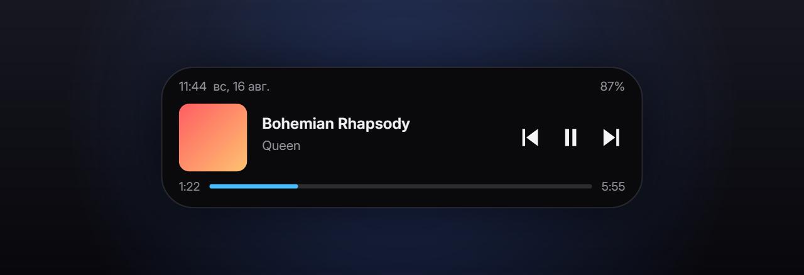

<div align="center">



<h1>DynamicIsland</h1>

<p><b>Динамический островок для Windows.</b><br>
Часы, заряд и плеер у верхней кромки экрана — на Direct3D 12,<br>
с нулевым расходом процессора в покое.</p>

<p>
<a href="https://github.com/FSDITM/DynamicIsland/releases/latest"></a>


</p>

</div>

<br>

## Что это

Островок живёт у верхней кромки экрана. В покое показывает время и заряд,
при наведении раскрывается в плеер с обложкой, названием трека и перемоткой.
Когда мешает — сворачивается в тонкую полоску или исчезает совсем.

## Возможности

🎵 &nbsp;**Плеер.** Обложка, название, исполнитель, пауза, переключение треков
и полоса перемотки — через штатный `GlobalSystemMediaTransportControls`.
Работает со Spotify, браузерами и любыми плеерами без плагинов.

✨ &nbsp;**Показ нового трека.** При смене песни островок сам раскрывается
на несколько секунд и сворачивается обратно.

🪟 &nbsp;**Умная адаптация формы.** Сворачивается в полоску только под теми
приложениями, которым реально мешает — по умолчанию под браузерами, у них
сверху вкладки. Терминалу эта полоса экрана не нужна, и там островок остаётся
целым. В полноэкранном режиме убирается совсем.

🖱️ &nbsp;**Не перехватывает чужие клики.** Окно сжато регионом до самой фигуры
островка: за её пределами приложения для системы просто нет.

⚙️ &nbsp;**Настройки.** Размеры каждого состояния, цвета, скругление,
прозрачность, задержки, выбор монитора, состав содержимого, горячая клавиша.

<br>

<div align="center">
  
  <br><br>
  
</div>

<br>

## Установка

1. Скачайте **[`DynamicIsland-setup.exe`](https://github.com/FSDITM/DynamicIsland/releases/latest)**
2. Запустите. Windows SmartScreen покажет предупреждение — установщик не подписан
   сертификатом. Нажмите **«Подробнее» → «Выполнить в любом случае»**
3. При установке можно сразу включить запуск при входе в систему

Права администратора не нужны — приложение ставится в папку пользователя.
**.NET устанавливать не надо**, он уже внутри.

После установки островок появится вверху экрана, а значок — в трее.
Настройки открываются кликом по значку.

**Требуется:** Windows 10 версии 21H2 (сборка 19041) или новее, x64,
видеокарта с поддержкой Direct3D 12 — подойдёт любая с 2015 года.

**Удаление:** Параметры → Приложения → DynamicIsland. Настройки останутся
в `%APPDATA%\DynamicIsland`.

<br>

## Почему быстро

| | |
|---|---|
| **Покой** | 0.000% одного ядра за 20 секунд |
| **Анимация** | 60 fps, 1.2 мс процессорного времени на кадр |
| **Первый кадр** | 70 мс — разовая компиляция шейдеров |
| **Память** | ~95 МБ приватной |

Так вышло не само собой — за этим три решения.

**Окно размером с островок, а не с экран.** Оверлеи часто делают полноэкранным
прозрачным окном. Такое приходится перерисовывать целиком каждый кадр, и оно
накрывает собой весь рабочий стол.

**Кадр не покидает видеопамять.** Окно с `WS_EX_NOREDIRECTIONBITMAP` отдаёт
содержимое напрямую DirectComposition, а рисует его Skia на Direct3D 12.
Обычный путь — layered-окно — гонит каждый кадр через системную память.

**В покое кадров нет вообще.** Пружины анимации сообщают, когда успокоились,
и поток засыпает до следующего события. Ни таймеров, ни опроса: смена трека
приходит из WinRT, смена активного окна — из `SetWinEventHook`.

<br>

## Сборка из исходников

Нужен [.NET SDK 10](https://dotnet.microsoft.com/download).

```bash
git clone https://github.com/FSDITM/DynamicIsland.git
cd DynamicIsland
dotnet run --project src/DynamicIsland.App -c Release
```

<details>
<summary><b>Служебные режимы</b> — интерфейс проверяется снимками, а не на глаз</summary>

<br>

| Команда | Что делает |
|---|---|
| `--selftest 8` | гоняет анимацию 8 секунд и пишет метрики в лог |
| `--snapshot <папка>` | рисует все состояния островка в PNG на трёх фонах |
| `--previewsettings <папка> [масштаб]` | отрисовывает окно настроек и меню в PNG |
| `--testmenu` | прогоняет нажатие по пункту меню тем же путём, что и мышью |
| `--icon <ico> [png]` | пересобирает логотип приложения |
| `--banner <png>` | рисует обложку для этого README |
| `--watchtest <секунд>` | пишет в лог все события смены окна и решение по каждому |

</details>

<details>
<summary><b>Сборка установщика</b></summary>

<br>

Нужен [Inno Setup 6](https://jrsoftware.org/isdl.php).

```bash
dotnet publish src/DynamicIsland.App -c Release -r win-x64 --self-contained true -o publish
ISCC.exe installer/DynamicIsland.iss
```

Готовый установщик появится в `dist/`. Номер версии он берёт из собранного
`.exe`, а тот — из `<Version>` в `DynamicIsland.App.csproj`: разъехаться они
не могут. Список выпусков — в [CHANGELOG.md](CHANGELOG.md).

</details>

<br>

## Устройство

```
src/DynamicIsland.App/
├── Interop/Win32.cs              P/Invoke: окно, монитор, DPI, DComp, трей, хуки
├── Platform/                     окно оверлея, трей, слежение за окнами, автозапуск
├── Rendering/                    D3D12 + composition swapchain + DComp + Skia
├── Services/                     плеер и батарея через WinRT, на событиях
├── Ui/                           состояния островка, отрисовка, шрифт, логотип
├── Configuration/                настройки, окно настроек, меню в трее
└── Program.cs                    планировщик кадров, метрики, служебные режимы
```

<details>
<summary><b>Как устроен кадр</b></summary>

<br>

Состоянием буфера управляет только этот код — Skia всегда застаёт ресурс
в объявленном ей состоянии:

```
ожидание fence ──► барьер Present → RenderTarget
               ──► Skia рисует
               ──► Flush + Submit
               ──► барьер RenderTarget → Present
               ──► Present(1)
```

Поэтому обёртки `SKSurface` кэшируются на каждый буфер, а не пересоздаются
каждый кадр.

**Почему регион окна, а не прозрачность для мыши.** У окна
с `WS_EX_NOREDIRECTIONBITMAP`, отрисованного через DirectComposition, ввод
не проходит насквозь в принципе: система не имеет доступа к видеопамяти окна
и не может проверить альфу пикселей. Ни `WS_EX_TRANSPARENT`, ни ответ
`HTTRANSPARENT` не работают — единственная настоящая граница это регион окна,
и он строится ровно по видимым пикселям.

</details>

<br>

## Известные ограничения

- Виджеты вроде файлового лотка, календаря и погоды не реализованы
- Цвета задаются hex-кодом, палитры с пипеткой нет
- Установщик не подписан сертификатом — отсюда предупреждение SmartScreen
- Слой валидации Direct3D 12 требует компонента Windows «Средства графики»

<br>

## Благодарности

Идея и первая реализация — [DynamicWin](https://github.com/FlorianButz/DynamicWin)
Флориана Бутца. Исходники оригинала были удалены из репозитория в октябре
2025 года; этот проект написан заново, но начался с изучения того кода.

Шрифт [Inter](https://github.com/rsms/inter) — Расмус Андерссон,
SIL Open Font License.

<br>

<div align="center">
<sub><a href="LICENSE">MIT</a></sub>
</div>
